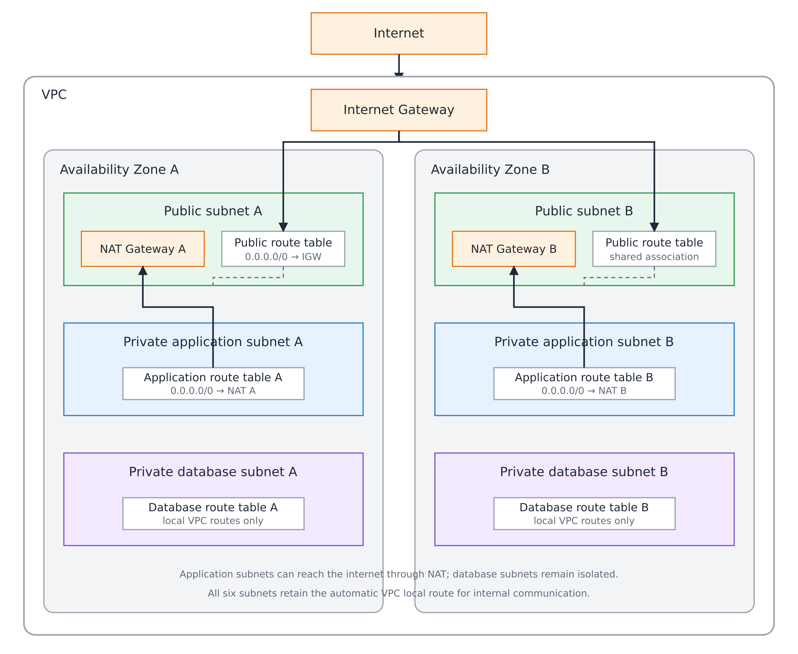

# AWS Production Infrastructure Foundation

## Business Scenario

NovaPay a fintech organization deploys its first containerized production application on AWS. In achieving this it had to first setup its netwoking infrastructure using  infrastructure as code configuration files to easily manage and deploy its application.

## Architecture

## Infrastructure

VPC/subnets/routing/NAT/etc.

## Design Decisions

#### Why public/private/DB tiers exist:

#### Why two AZs are used:

1. Reduces single point of failure
2. Higher reliability

#### Why modules are used:

1. Reusable across multiple environments
2. Testability
3. Easily version controlled

#### Why for_each was selected:

1. Reduces code redundancy and duplicity
2. Facilitate data manipulation easily

#### Why remote state is used:

1. Version control
2. CICD operation
3. Teams can easily access, share and modify state where necessary

## Repository Structure

terraform-aws-network

	|-----architecture

	|-----bootstrap-backend

	|-----environments

		|-----dev

	|-----modules

		|-----network

	|-----gitignore

	|-----readme

## Prerequisites

1. Install terraform
1. 

## Deployment

* terraform init
* terraform plan
* terraform apply

## Validation

## Security Considerations

* Public subnet
      ↓
  can route to Internet Gateway
* Private application subnet
      ↓
  does NOT route directly to Internet Gateway
      ↓
  NAT provides outbound connectivity

* Private database subnet
      ↓
  does NOT have direct Internet routing

## Cost Considerations

## Cleanup

terraform destroy
